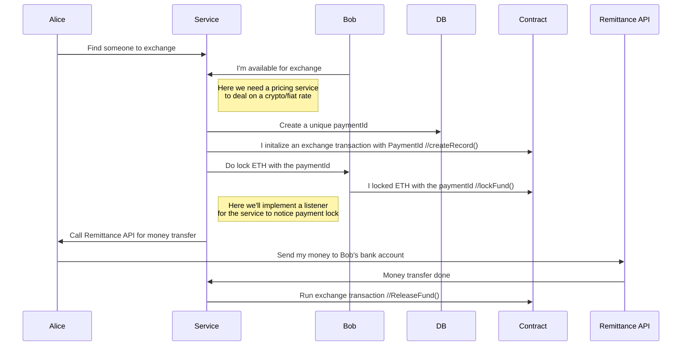

# hackathon

<!-- ABOUT THE PROJECT -->

## About The Project

This sample project implements a **location-based and bank-backed mini exchange system** on hardhat.

The project mainly consists of the contracts, the tests and the deployment scripts. It's also planned to locate a user interface and a backend system in it soon.


## High-Level Overview

![HL Overview][hl-overview]

**1-** Alice finds someone(Bob) to exchange nearby

**2-** Bob’s fund gets locked on the smart contract

**3-** Alice calls money transfer service of the bank

**4-** Once the transfer executed, service pushes the contract

**5-** The contract transfers the fund to Alice’s wallet

### UML



## Run
To run the project:

Please notice that you need to create your own .env file with your credentials and never share/post it.

Create .env file with following command on terminal

```sh
touch .env
```

The .env file should look something like below

```sh
PRIVATE_KEY = <HERE_COMES_YOUR_PRIVATE_KEY>
RINKEBY_URL = <ALCHEMY_RINKEBY_URL>
ETHERSCAN_KEY = <ETHERSCAN_KEY>
```

To run the tests:

```sh
npx hardhat test
```

To compile contracts:

```sh
npx hardhat compile
```

To deploy the contracts to Rinkeby Testnet:

```sh
npx hardhat run deployments/deployContract.js --network rinkeby
```

To verify the contracts on Rinkeby Testnet:

```sh
hardhat verify — network <networkName> <contractAddress> <ConstructorArguments>
```

in this case

```sh
npx hardhat verify --network rinkeby <CONTRACT_ADDRESS> "hacko"
```

<p align="right">(<a href="#top">back to top</a>)</p>

[hl-overview]: images/d2.drawio.png
